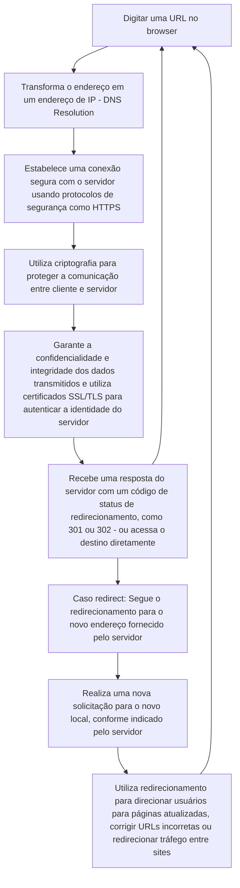

<h1 align="center">
  CEP API 
</h1>

## Descrição

Este projeto visa desenvolver uma API robusta para a consulta de endereços utilizando como entrada o Código de Endereçamento Postal (CEP) do usuário. A API deve ser capaz de retornar informações detalhadas como rua, bairro, cidade e estado, além de tratar situações onde o CEP pode estar incompleto ou ser inválido.

---

## Arquitetura

Esse projeto é uma implementaçao de clean architecture, tentando ao máximo seguir as boas práticas de desenvolvimento de APIs. 

A arquitura usada levou em consideração os seguintes componentes (ou camadas):

| Componente   | Descrição                                                                                           |
|--------------|-----------------------------------------------------------------------------------------------------|
| **Entities**    | Representa as entidades de domínio do projeto, como objetos que refletem conceitos do negócio.     |
| **Usecases**  | Contém a lógica de negócio do sistema, implementando os casos de uso específicos da aplicação.     |
| **Middleware**  | Responsável por interceptar e processar requisições antes de chegarem aos controllers.             |
| **Controllers**  | Recebem requisições, interagem com os usecases e retornam respostas adequadas para o cliente.      |
| **Utils**        | Módulo contendo funções utilitárias reutilizáveis em diferentes partes do projeto.                 |
| **Mocks**        | Utilizado para simular comportamentos de componentes externos durante testes ou desenvolvimento.  |

### Por que essa arquitetura?

Essa arquitetura torna os ajustes ou novas implementações menos sofridas, onde as camadas se comunicam mas não estão "presas" umas as outras, tendo cada camada sua própria resposabilidade. Um outro fator é que possibilita testes desacoplados.

---

## Tecnologias Utilizadas

| Tecnologia | Descrição                                                                                   |
|------------|---------------------------------------------------------------------------------------------|
| **Go**        | Linguagem de programação compilada e de tipagem estática, projetada para simplicidade e eficiência. |
| **Gin**         | Um framework web escrito em Go que é usado para construir APIs de alta performance com um mínimo de recursos. |
| **Swaggo**      | Ferramenta para Go que gera automaticamente documentação de API RESTful com Swagger. |
| **Sentry**      | Serviço que ajuda a detectar, monitorar e corrigir falhas em tempo real em toda a stack da app. |
| **Mockery**     | Ferramenta para gerar mocks para testes em Go, facilitando a criação de unit tests. |
| **GitHub Actions**        | Ferramenta utilizada para rodar os testes quando um PR é submetido para a branch `main`.  |
| **Supabase**        | Alternativa de código aberto ao Firebase. possibilita a instanciação de um banco de dados Postgres, Autenticação e autorização. No contexto desse projeto, foi utilizado para a criação de uma tabela de Cep e uma função para buscar um endereço por CEP.  |

---

## Rodando o projeto

### Pré-requisitos

- Go
- [Swaggo](https://github.com/swaggo/swag?tab=readme-ov-file#getting-started)

### Instruções

> **Importante**: o arquivo .env.example mostra como deve ser o .env do projeto, que é necessário para rodar a app. Um exemplo é a variável HTTP_PORT.

1. Clone o repositório
2. `go mod tidy`
3. Execute o comando `make run`

> **Nota**: `make run` installa o swaggo, roda `swaggo init` para gerar as docs e `go run main.go` para inicializar o projeto. Para rodar os testes, `make test`. Uma GitHub action também roda os testes quando um PR é submetido para a branch **main**.

---

## Licença

Este projeto é distribuído sob a licença MIT License, que é uma licença de código aberto. Isso significa que qualquer pessoa pode livremente usar, modificar e distribuir o código-fonte, desde que as condições da licença MIT License sejam respeitadas. Para mais detalhes sobre o que é permitido ou não sob esta licença, visite [MIT License](https://opensource.org/license/mit).

A escolha desta licença visa promover uma colaboração aberta e o uso livre do software, permitindo que a comunidade contribua e beneficie-se das melhorias continuamente.

---

## Exemplos de uso

Exemplos de uso podem ser encontrados no projeto em `/test/postman`, onde se encontra a collection do postman e em `/test/`, onde se encontra os arquivos `.http` que podem ser usados para testar diretamente da IDE.

---

## HTTP

1. Ao digitar uma URL no browser, primeiramente, o endereço deve ser transformado em um endereço de IP. Isso acontece atravas de DNS Resolution.
2. Após a resolução de DNS, o navegador estabelece uma conexão segura (ou nao, depende) com o servidor por meio de protocolos de segurança como o HTTPS, que utiliza criptografia para proteger a comunicação entre o cliente e o servidor. O HTTPS garante a confidencialidade e integridade dos dados transmitidos, evitando que informações sensíveis sejam interceptadas por terceiros. Além disso, certificados SSL/TLS são utilizados para autenticar a identidade do servidor, garantindo que o navegador está se comunicando com o servidor correto.
3. Quando um servidor recebe uma solicitação, ele pode responder com um código de status de redirecionamento, como o código 301 (Permanent Redirect) ou 302 (Temporary Redirect), ou acessar destino diretamente. Caso haja um redirect, o navegador então segue o redirecionamento e faz uma nova solicitação para o novo endereço fornecido pelo servidor. Redirects podem ser usados para:
   1. Direcionar para uma página atualizada
   2. Corrigir URLs incorretas
   3. Redirecionar tráfego de um site para outro
4. Depois desse processo todo, a request acessa o servidor que processa a request, executa a lógica e gera a resposta apropriada, que retorna para o cliente.

